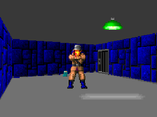

# Section 04 - Software.

Software Section.

# What I learned.

# Tricks.

- Add here the chapters.

### Cos/Sin Table Lookup.

- Add here the chapters.

###  FizzleFade.

> The legendary dying animation!

    

    

1. Two main usages of this animation:
    - Hero dying.
    - Kills the boss.

2. You can check the site for [article](https://fabiensanglard.net/fizzlefade/).

    

    

    

    

    

    

    

    

### Palette.

.....