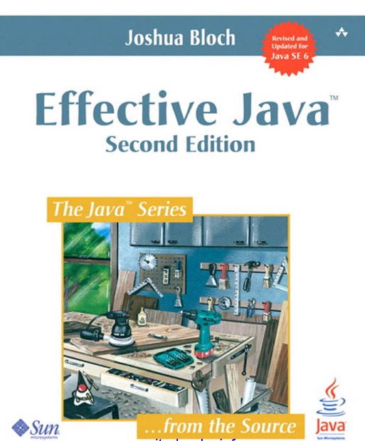
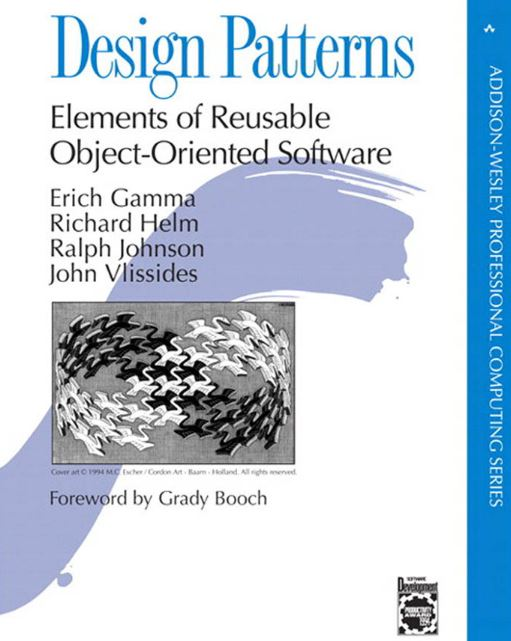

    
  <text>✨Books and its progress✨</text>

 This will be my remote place to store books, when **progressing** thought them. They contain the **notes** also!

 > I created to this to have some way for my future employer to see that I know this stuff and add links to cv that "these i have read".

- Todo check the lisences! Some have Creative and some are free. Some are not. 

    

#### Progress/Curriculum.

- [x] [Section 01](#) - Chapters here from the book!

#### Additional stuff.

- [x] All over the web, or example this one. [Source](https://www.doc-developpement-durable.org/file/Projets-informatiques/cours-&-manuels-informatiques/java/Effective%20Java,%202nd%20Edition.pdf)! ✅

    

#### Progress/Curriculum.

- [x] [Section 01](#) - Chapters here from the book!

    

#### Progress/Curriculum.

 <b> Wolfenstein 3D progress! </b> 

- [ ] [Section 01: Introduction](#).
    - ...
- [ ] [Section 02: Hardware](#).
    - ...
- [ ] [Section 03: Team](#).
    - ...
- [ ] [Section 04: Software](https://github.com/developersCradle/books/tree/main/Books/Game%20Engine%20Black%20Book%203d/Game%20Engine%20Black%20Book%203d/Section%2004%20-%20Software#section-04---software)
    - [ ] [Tricks](https://github.com/developersCradle/books/tree/main/Books/Game%20Engine%20Black%20Book%203d/Game%20Engine%20Black%20Book%203d/Section%2004%20-%20Software#tricks).
        - [ ] [Cos/Sin Table Lookup](#).
        - [x] [FizzleFade](https://github.com/developersCradle/books/tree/main/Books/Game%20Engine%20Black%20Book%203d/Game%20Engine%20Black%20Book%203d/Section%2004%20-%20Software#fizzlefade). ✅
        - [ ] [Palette](#).
- [ ] [Section 05: Sequels](#).
    - ...
- [ ] [Section 06: Ports](#)
    - ...
- [ ] [Section 07: Epilogue](#)
    - ...

#### Additional stuff.

- [x] [Source](https://fabiensanglard.net/gebbwolf3d/)! ✅
- Make the folder as in the book hierarchy.
- Add this to chapter. (https://www.youtube.com/watch?v=LUbrzg21X9c).

    

#### Progress/Curriculum.

- [x] [Section 01](#) - Chapters here from the book!

#### Additional stuff.

- [x] All over the web, or example this one. [Source](https://www.google.com/url?sa=t&source=web&rct=j&opi=89978449&url=https://dl.ebooksworld.ir/motoman/Refactoring.Improving.the.Design.of.Existing.Code.2nd.edition.www.EBooksWorld.ir.pdf&ved=2ahUKEwjuv8259I-QAxXHCRAIHQBzCUIQFnoECBQQAQ&usg=AOvVaw1MLThxPyH9Jrcnf3HYC7he)! ✅

    

#### Progress/Curriculum.

- [x] [Section 01](#) - Chapters here from the book!
- [x] [Section 02 - Git Basics](#)
- [x] [Section 03 - Git Branching](#)
- [x] [Section 04 - Git on the Server](#)
- [x] [Section 05 - Distributed Git](#)
- [x] [Section 06 - GitHub](#)
- [x] [Section 07 - Git Tools](#)
- [x] [Section 08 - Customizing Git](#)
- [x] [Section 09 - Git and Other Systems](#)
- [x] [Section 10 - Git Internals](#)

#### Additional stuff.

- [x] All over the web, or example this one. [Source](https://git-scm.com/book/en/v2)! ✅

    

#### Progress/Curriculum.

- [x] [Section 01](#) - Chapters here from the book!

#### Additional stuff.

- [x] All over the web, or example this one. [Source](https://www.javier8a.com/itc/bd1/articulo.pdf)! ✅

