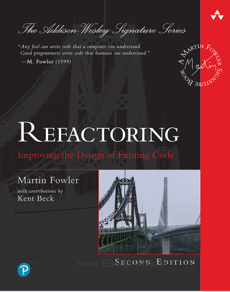

    
  <text>✨Books and its progress✨</text>

 This will be my remote place to store books, when **progressing** thought them. They contain the **notes** also!

    

#### Progress/Curriculum.

- [x] [Section 01](#) - Chapters here from the book!
- [x] [Section 02](#) - Chapters here from the book!
- [x] [Section 03](#) - Chapters here from the book!
- [x] [Section 04](#) - Chapters here from the book!
- [x] [Section 05](#) - Chapters here from the book!
- [x] [Section 06](#) - Chapters here from the book!
- [x] [Section 07](#) - Chapters here from the book!
- [x] [Section 08](#) - Chapters here from the book!
- [x] [Section 09](#) - Chapters here from the book!

    

#### Progress/Curriculum.

- [x] [Section 01](#) - Chapters here from the book!
- [x] [Section 02](#) - Chapters here from the book!
- [x] [Section 03](#) - Chapters here from the book!
- [x] [Section 04](#) - Chapters here from the book!
- [x] [Section 05](#) - Chapters here from the book!
- [x] [Section 06](#) - Chapters here from the book!
- [x] [Section 07](#) - Chapters here from the book!
- [x] [Section 08](#) - Chapters here from the book!
- [x] [Section 09](#) - Chapters here from the book!

#### Additional stuff.

- [x] [Source](https://fabiensanglard.net/gebbwolf3d/)! ✅

    

#### Progress/Curriculum.

- [x] [Section 01](#) - Chapters here from the book!
- [x] [Section 02](#) - Chapters here from the book!
- [x] [Section 03](#) - Chapters here from the book!
- [x] [Section 04](#) - Chapters here from the book!
- [x] [Section 05](#) - Chapters here from the book!
- [x] [Section 06](#) - Chapters here from the book!
- [x] [Section 07](#) - Chapters here from the book!
- [x] [Section 08](#) - Chapters here from the book!
- [x] [Section 09](#) - Chapters here from the book!

#### Additional stuff.

- [x] All over the web, or example this one. [Source](https://www.google.com/url?sa=t&source=web&rct=j&opi=89978449&url=https://dl.ebooksworld.ir/motoman/Refactoring.Improving.the.Design.of.Existing.Code.2nd.edition.www.EBooksWorld.ir.pdf&ved=2ahUKEwjuv8259I-QAxXHCRAIHQBzCUIQFnoECBQQAQ&usg=AOvVaw1MLThxPyH9Jrcnf3HYC7he)! ✅

